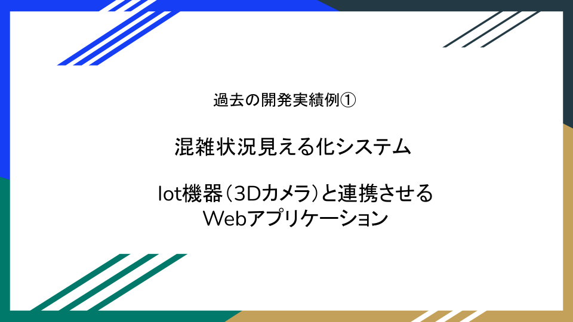
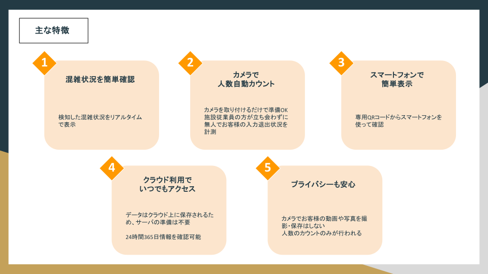
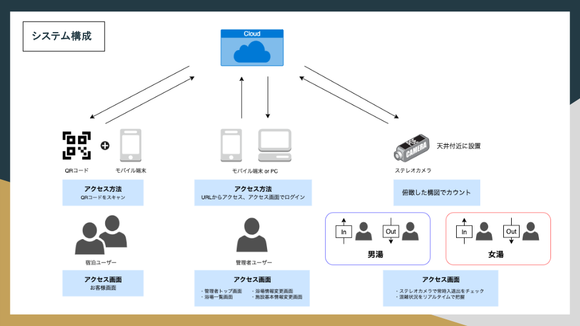
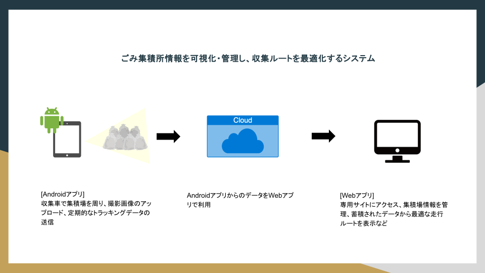
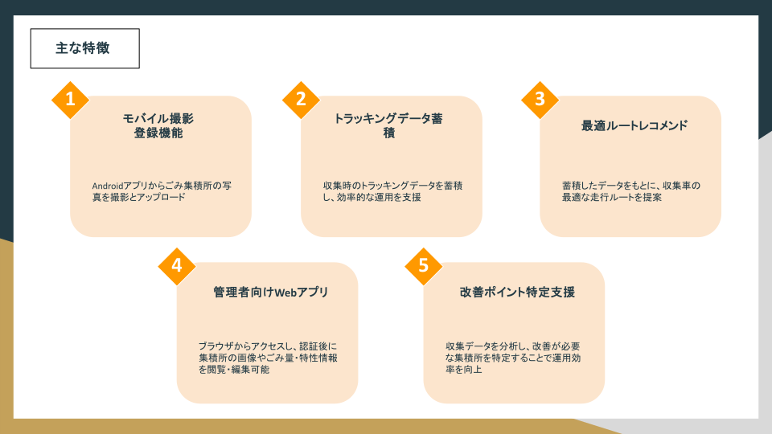

  

##  tech-mwの紹介
- [経歴] 声優 → EC → Web制作 → Webエンジニア
- [開発領域] 主にWebアプリケーション開発。その他、IoT機器連携アプリ（3Dカメラ・検温デバイス等）、Androidアプリ（React Native）など経験あり
- [過去の参画PJ] 3Dカメラ利用 混雑状況見える化システム、電子書籍配信アプリ
- [個人開発] 不動産マッチングアプリ「Shavilla：Share（共有） × Villa（物件）」（Ruby/Rails）
- [開発以外スキル]
  - デザイン／マークアップ：UI設計からフロント実装まで対応  
  - アクセス解析：Google Analytics等を用いた解析
  - EC運営：楽天（RMS）、Amazon（セラーセントラル/ASC）、Yahoo!ショッピング（ストアクリエイターPro/SCP）  
  - イラスト制作：Clip Studio Pro、Illustratorによる制作  
  - ナレーション：声優経験を活かした音声収録（Webサイト開発と併せた収録対応経験あり）

---

## 💻 直近よく使う技術

- skill-aiconsにアイコンがなかった技術はテキストで下記に記載
  - AI駆動
    - [devin](https://devin.ai/)
    - [claude-code](https://docs.claude.com/ja/docs/agents-and-tools/claude-code/overview)
    - 各種mcp 
## 🕑 過去使っていた技術
  
- skill-aiconsにアイコンがなかった技術はテキストで下記に記載
  - [react-native](https://reactnative.dev/)
  - llm（[ollama](https://ollama.com/)/無料 × local など）
  - etc..

---

## 🏃‍♀️ 活動履歴
<!-- GitHub Stats -->

  
  

<!-- 3D Contributions -->

  

---

<!-- Trophy -->

---

<!-- Summary Cards -->

---
## 🛠 これまでの開発事例
### 事例01
> Iot機器と連携させるSaas型のWebアプリケーション。フロントエンド、サーバーサイド、AWSインフラなどすべての領域において開発を担当した「ComiAI-混雑状況見える化システム」が令和3年度の会津産IT技術認定を受賞しました。
> ソーシャルディスタンスをキープしながら温泉を安全に楽しめるよう、ステレオカメラとクラウド型のシステムを活用し、プライバシーへの配慮が必要である浴場内を直接撮影することなく混雑状況をリアルタイムで見える化するシステム。非対面でお客様の入退出カウントと浴場毎の混雑状況の見える化が可能であり、お客様はお手持ちのスマートフォンで混雑状況を確認できる。クラウドのデータを利用する統計グラフ機能は週のどの曜日のどの時間帯が混んでいるのか混雑状況をグラフで視覚化して一目で把握する事が可能。

#### 使用技術

### 事例02
> androidのnativeアプリとブラウザからアクセスするwebアプリからなる管理システム。 androidアプリから撮影画像やGPS情報を取得して撮影場所のごみ集積所の場所・日時・ごみの量の登録やトラッキングデータの蓄積から最適な走行ルートのレコメンド、webアプリでは管理者が認証する事でごみ集積所の画像を表示、ごみの量・分析状況など特性情報を編集する事が可能な他、傾向分析機能で改善が必要とされる集積所を特定可能。

#### 使用技術

- skill-aiconsにアイコンがなかった技術はテキストで下記に記載
  - [react-native](https://reactnative.dev/)

## 📚 Zenn 投稿記事
<!-- BLOG-POST-LIST:START -->
- [GitHubプロフィールに「3D活動状況グラフ」を表示する（Actionsで毎日自動更新）](https://zenn.dev/tech_mw/articles/4df0ab135b2e55)
- [Django CBV × SuccessMessageMixin でメッセージ最小実装（Create / Delete 対応）](https://zenn.dev/tech_mw/articles/8493482e8a296e)
- [detached HEADを意図的に再現して検証：fast-forward](https://zenn.dev/tech_mw/articles/32b7f269f99eb6)
- [detached HEADを意図的に再現して検証：non-fast-forward](https://zenn.dev/tech_mw/articles/58623069e633b2)
- [Dockerコンテナとホスト間のファイル共有・バックアップガイド](https://zenn.dev/tech_mw/articles/f20460bf1882ae)
<!-- BLOG-POST-LIST:END -->

## 🧾 Zenn 投稿スクラップ
- [【久々に触れると忘れる/備忘録】定義方法と呼び出し方で変化するthis（TypeScript）](https://zenn.dev/tech_mw/scraps/9d2edb4b6703ae)
- [久々に触れると忘れる、JavaScript特有の「巻き上げ（Hoisting）」備忘録](https://zenn.dev/tech_mw/scraps/7c7c6f09643a28)
- [zshの履歴に日時を表示する](https://zenn.dev/tech_mw/scraps/325184db5f9be3)
- [Docker環境で学ぶ 0.0.0.0 と 127.0.0.1 の違いと確認方法](https://zenn.dev/tech_mw/scraps/867535328bbb2f)
- [PyCharm CEでDjangoテストが走らない→「Python」構成 +「Python test」構成 それぞれでの解決方法](https://zenn.dev/tech_mw/scraps/012acdb3fe0355)
- [PyCharm CEでDjangoデバッグ時にisAliveエラーが出る原因と解決法【Python 3.13対応】](https://zenn.dev/tech_mw/scraps/ef75be3b446e03)
- [【Python試験対策】ビット演算子まとめ（&、|、^、~、<<、>>）](https://zenn.dev/tech_mw/scraps/4ecb9f97f7e24c)
- [【Python試験対策】n進数変換の超シンプル基数変換チートシート](https://zenn.dev/tech_mw/scraps/b70956b196fb58)
- [Djangoでページネーションを簡単に実装する方法（ListView + Bootstrap対応）](https://zenn.dev/tech_mw/scraps/8beca5d8db8af3)
- [なぜFBVはredirect、CBVはreverse_lazyなのか？Djangoの評価タイミングを理解する](https://zenn.dev/tech_mw/scraps/d6c5a13e1b56dd)
- [PlantUML + PyCharm でER図作成｜draw.ioからの乗り換えメモ](https://zenn.dev/tech_mw/scraps/3d23260e0cd5dc)
- [PyCharmで複数プロジェクトを1つのウィンドウで開けなくなった話（解決）](https://zenn.dev/tech_mw/scraps/ef36d1a6147208)
- [MySQL × Docker × 日本語文字列が空白になる問題と対策（UTF-8・locale編）](https://zenn.dev/tech_mw/scraps/6c852e8a92910a)
- [Docker Compose × MySQL × Sequel Ace接続ガイド](https://zenn.dev/tech_mw/scraps/980d80c033d0c0)
- [Docker（手動 + compose）でWordPressとMySQL環境構築手順](https://zenn.dev/tech_mw/scraps/dd73ac4159c154)
- [【docker-compose × express × PostgreSQL】データ永続化確認、ボリュームマウントとバインドマウントなど](https://zenn.dev/tech_mw/scraps/65e66307eed7f8)
- [FastAPI例外ハンドラ：レスポンスカスタマイズ](https://zenn.dev/tech_mw/scraps/bd69effdce24ae)
- [FastAPIのBody(embed=True)でハマった話：/docsが利口すぎて気づきにくい罠](https://zenn.dev/tech_mw/scraps/aa8e017fac75c3)
- [【Mac】PyCharmで Cmd+↑+F を使うとFinder検索が開いてしまう問題の対処法](https://zenn.dev/tech_mw/scraps/2ff3528dd6ba3e)
- [Pythonのダックタイピングをスプーンで説明してみた](https://zenn.dev/tech_mw/scraps/9a93b308e607d9)
- [PyCharmデバッグ機能の基本操作まとめ](https://zenn.dev/tech_mw/scraps/8a7173c90de3a9)
- [tcl/tk/wishって何？git guiの裏側にある“知られざる世界”を覗いてみた](https://zenn.dev/tech_mw/scraps/0d5cfc5b63c8ab)
- [Git初心者がハマる！git diffで差分が出ない理由と解決法](https://zenn.dev/tech_mw/scraps/05fd3bc7219100)
- [SourceTreeがed25519のSSH鍵を認識しなかった話](https://zenn.dev/tech_mw/scraps/6c7abac2abe5d5)

## 📝 資格
- Pythonプログラミング能力認定試験 2級（OpenBadge認定）
- WACAウェブ解析士協会公認 上級ウェブ解析士

