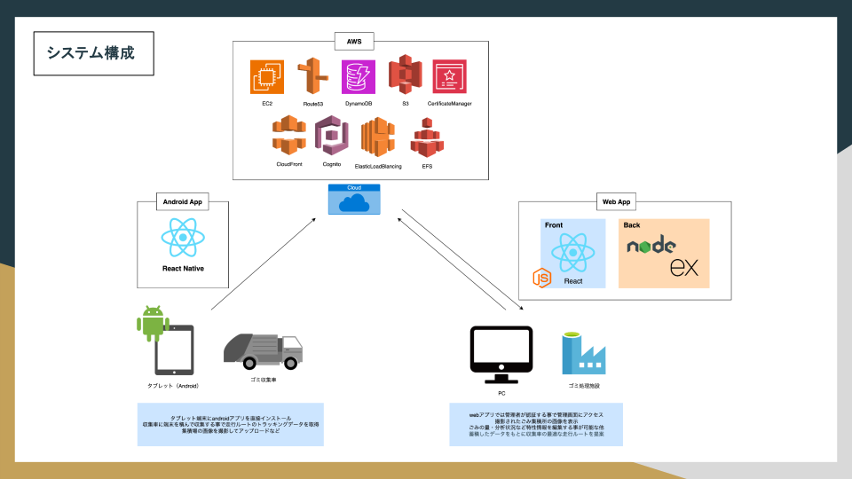

  

##  About tech-mw
- Former voice actor | Past projects include 3D camera crowding app and property matching app

---

## 💻 Current Skill

## 🕑 Previously Used Skill
  
- skill-aiconsにアイコンがなかった技術はテキストで下記に記載
  - [react-native](https://reactnative.dev/)

## 📚 Currently Learning
- skill-aiconsにアイコンがなかった技術はテキストで下記に記載
  - [cursor](https://cursor.com/ja)
  - [claude-code](https://www.anthropic.com/claude-code)
  - etc..
---

## 🏃‍♀️ Activities
<!-- GitHub Stats -->

---

<!-- Trophy -->

---

<!-- Summary Cards -->

---
## 🛠 Past development examples
### examples01
> In Development Example 01, we will introduce developments that respond to the COVID-19 pandemic.
> The image below shows the system concept, functions, and architecture.

#### skill

### examples02
> In Development Example 02, we present a system designed to visualize and manage waste collection point data and optimize collection routes.
> The image below shows the system concept, functions, and architecture.

#### skill

- skill-aiconsにアイコンがなかった技術はテキストで下記に記載
  - [react-native](https://reactnative.dev/)

## 📚 Zenn Posts
<!-- BLOG-POST-LIST:START -->
- [detached HEADを意図的に再現して検証：fast-forward](https://zenn.dev/tech_mw/articles/32b7f269f99eb6)
- [detached HEADを意図的に再現して検証：non-fast-forward](https://zenn.dev/tech_mw/articles/58623069e633b2)
- [Dockerコンテナとホスト間のファイル共有・バックアップガイド](https://zenn.dev/tech_mw/articles/f20460bf1882ae)
<!-- BLOG-POST-LIST:END -->

## 🧾 Zenn Logs
- [Djangoでページネーションを簡単に実装する方法（ListView + Bootstrap対応）](https://zenn.dev/tech_mw/scraps/8beca5d8db8af3)
- [なぜFBVはredirect、CBVはreverse_lazyなのか？Djangoの評価タイミングを理解する](https://zenn.dev/tech_mw/scraps/d6c5a13e1b56dd)
- [PlantUML + PyCharm でER図作成｜draw.ioからの乗り換えメモ](https://zenn.dev/tech_mw/scraps/3d23260e0cd5dc)
- [PyCharmで複数プロジェクトを1つのウィンドウで開けなくなった話（解決）](https://zenn.dev/tech_mw/scraps/ef36d1a6147208)
- [MySQL × Docker × 日本語文字列が空白になる問題と対策（UTF-8・locale編）](https://zenn.dev/tech_mw/scraps/6c852e8a92910a)
- [Docker Compose × MySQL × Sequel Ace接続ガイド](https://zenn.dev/tech_mw/scraps/980d80c033d0c0)
- [Docker（手動 + compose）でWordPressとMySQL環境構築手順](https://zenn.dev/tech_mw/scraps/dd73ac4159c154)
- [【docker-compose × express × PostgreSQL】データ永続化確認、ボリュームマウントとバインドマウントなど](https://zenn.dev/tech_mw/scraps/65e66307eed7f8)
- [FastAPI例外ハンドラ：レスポンスカスタマイズ](https://zenn.dev/tech_mw/scraps/bd69effdce24ae)
- [FastAPIのBody(embed=True)でハマった話：/docsが利口すぎて気づきにくい罠](https://zenn.dev/tech_mw/scraps/aa8e017fac75c3)
- [【Mac】PyCharmで Cmd+↑+F を使うとFinder検索が開いてしまう問題の対処法](https://zenn.dev/tech_mw/scraps/2ff3528dd6ba3e)
- [Pythonのダックタイピングをスプーンで説明してみた](https://zenn.dev/tech_mw/scraps/9a93b308e607d9)
- [PyCharmデバッグ機能の基本操作まとめ](https://zenn.dev/tech_mw/scraps/8a7173c90de3a9)
- [tcl/tk/wishって何？git guiの裏側にある“知られざる世界”を覗いてみた](https://zenn.dev/tech_mw/scraps/0d5cfc5b63c8ab)
- [Git初心者がハマる！git diffで差分が出ない理由と解決法](https://zenn.dev/tech_mw/scraps/05fd3bc7219100)
- [SourceTreeがed25519のSSH鍵を認識しなかった話](https://zenn.dev/tech_mw/scraps/6c7abac2abe5d5)
